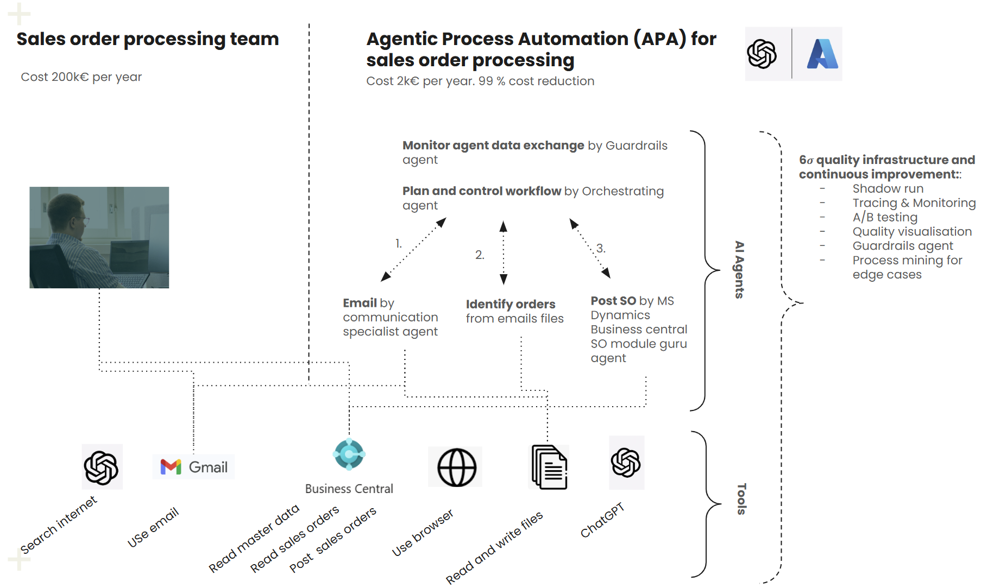

# OpenAI Agent SDK Demo

This repository demonstrates the OpenAI Agent SDK capabilities through specialized agent implementations for email processing, order identification, and Business Central integration. The OpenAI Agent SDK is a lightweight framework for building AI agents with minimal abstractions, following a Python-first design philosophy.

## Solution Overview



This solution implements an Agentic Process Automation (APA) system for sales order processing, reducing costs from 200k€ to just 2k€ per year (99% cost reduction). The system consists of:

1. **Email Agent**: Handles communication with customers via Gmail
2. **Order Identification Agent**: Identifies orders from emails and attached files
3. **Business Central Agent**: Posts identified orders to Microsoft Dynamics Business Central

The solution includes quality infrastructure with shadow runs, tracing & monitoring, A/B testing, quality visualization, and process mining for edge cases. The entire workflow is orchestrated and monitored by specialized agents.

## Installation

```bash
# Create and activate a virtual environment (Windows PowerShell)
python -m venv venv
.\venv\Scripts\Activate.ps1

# Install the OpenAI Agent SDK and other dependencies
pip install -r requirements.txt
```

## Environment Setup

Set your OpenAI API key directly in PowerShell:

```powershell
# Set the API key for the current PowerShell session
$env:OPENAI_API_KEY = "your-api-key-goes-here"
```

For persistent use across sessions, you can set it at the user level:

```powershell
# Set the API key at the user environment level (persists across sessions)
[Environment]::SetEnvironmentVariable("OPENAI_API_KEY", "your-api-key-goes-here", "User")
```

After setting the environment variable at the user level, you'll need to restart your PowerShell session for the changes to take effect.

### Business Central Environment Variables

To enable the Business Central integration, set the following environment variables:

```powershell
# Set Business Central environment variables
$env:BC_TENANT_ID = "your-tenant-id"
$env:BC_CLIENT_ID = "your-client-id"
$env:BC_CLIENT_SECRET = "your-client-secret"
$env:BC_COMPANY_NAME = "your-company-name"
```

## Project Components

This project demonstrates three specialized agent implementations and a flexible runner script:

### 1. Email Agent (email_agent.py)

An agent that can fetch emails from Gmail and send new emails. It saves email content and attachments to the local file system for further processing by other agents.

```python
from agents import Agent
from tools import fetch_gmail_emails, send_gmail_email

# Create an email agent with both fetch and send email tools
email_agent = Agent(
    name="Email Assistant",
    instructions="""You are a helpful email assistant that can fetch emails from Gmail and send new emails.

    When asked to check emails or if no specific action is requested:
    - Use the fetch_gmail_emails tool to retrieve emails from the inbox
    - You need to specify how many emails to fetch (max_results) and the path to the credentials file
    - Typically, use max_results=10 and credentials_path='credentials.json'
    - Summarize the emails you find, including the subject, sender, and a brief preview of the content
    - If no emails are found, inform the user that their inbox is empty

    When asked to send an email:
    - Use the send_gmail_email tool to send a new email
    - You need the recipient's email address (to), subject, body content, and credentials path
    - Always use credentials_path='credentials.json' unless specified otherwise
    - Confirm when the email has been sent successfully
    - If there's an error, explain what went wrong

    You can help draft emails based on instructions. Ask clarifying questions if needed about:
    - Who the email should be sent to
    - What the subject should be
    - What content should be included in the email
    """,
    tools=[fetch_gmail_emails, send_gmail_email],
)
```

**Technical Details:**
- Uses Gmail API to fetch and send emails
- Saves email content and attachments to the local file system
- Handles authentication with OAuth2
- Provides detailed email summaries
- Best run with the asynchronous `Runner.run` method

### 2. Order Identification Agent (order_agent.py)

An agent that uses GPT-4o vision capabilities to identify sales orders from emails and their attachments. It can analyze both text content and images to extract structured order information.

```python
from agents import Agent
from tools import identify_orders_from_all_emails

# Create an order identification agent with tools
order_agent = Agent(
    name="Order Identification Agent",
    instructions="""You are a helpful assistant that can identify sales orders from emails.

    When asked to identify orders from all emails:
    - Use the identify_orders_from_all_emails tool to analyze all email folders
    - Summarize all orders found, including counts and key details
    - If you can't identify any orders, explain why
    """,
    # Using the batch processing tool for analyzing all email folders at once
    # This is the tool used in the orchestration workflow
    tools=[identify_orders_from_all_emails],
    handoffs=[],  # Empty handoffs list
)
```

**Technical Details:**
- Uses GPT-4o vision capabilities to analyze both text and images in emails
- Extracts sales order information from email content and attachments
- Validates extracted data against master data (customers and items)
- Repairs and normalizes order information
- Returns results in a structured JSON format
- Saves identified orders to JSON files for further processing

### 3. Business Central Agent (bc_agent.py)

An agent that can post identified orders to Business Central. It takes the structured order data identified by the Order Identification Agent and creates sales orders in Business Central.

```python
from agents import Agent
from tools import post_order_to_business_central, post_all_orders_to_business_central

# Create a Business Central agent with both single order and batch processing tools
bc_agent = Agent(
    name="Business Central Agent",
    instructions="""You are a helpful assistant that can post identified orders to Business Central.

    When asked to post a specific order:
    - Use the post_order_to_business_central tool to post the order
    - You need to specify the path to the identified_order.json file (order_file_path)
    - Summarize the result, including the order number, customer, and delivery date
    - If there's an error, explain what went wrong

    When asked to post all orders:
    - Use the post_all_orders_to_business_central tool to post all identified orders
    - You can optionally specify the path to the emails directory (emails_dir_path)
    - Summarize all posted orders, including counts and key details
    - If there are errors, explain what went wrong
    """,
    tools=[post_order_to_business_central, post_all_orders_to_business_central],
)
```

**Technical Details:**
- Integrates with Business Central API to create sales orders
- Handles authentication with Azure AD OAuth2
- Creates sales order headers and lines
- Supports both single order and batch processing
- Provides detailed logging and error handling
- Saves response data for each processed order

### 4. Orchestration Agent (orchestration_agent.py)

An agent that orchestrates the entire process by coordinating the three specialized agents in sequence. This agent provides a single entry point for the complete end-to-end workflow.

```python
from agents import Agent
from email_agent import email_agent
from order_agent import order_agent
from bc_agent import bc_agent

# Create an orchestration agent that coordinates the three specialized agents using handoffs
orchestration_agent = Agent(
    name="Orchestration Agent",
    instructions="""You are an orchestration agent that coordinates the entire sales order processing workflow.
    
    Your job is to manage the end-to-end process by delegating tasks to three specialized agents:
    
    1. Email Agent: Fetches emails from Gmail and saves them to the local file system
       - Use this agent for tasks related to fetching or sending emails
       - Default command: "Fetch 10 emails from my inbox using credentials_path='credentials.json'"
       
    2. Order Identification Agent: Identifies sales orders from the fetched emails
       - Use this agent for tasks related to identifying and extracting order information
       - Default command: "Identify orders from all emails in the emails directory"
       
    3. Business Central Agent: Posts the identified orders to Business Central
       - Use this agent for tasks related to posting orders to Business Central
       - Default command: "Post all identified orders to Business Central"
    
    When asked to run the complete workflow:
    1. First, hand off to the Email Agent to fetch emails
    2. Then, hand off to the Order Identification Agent to identify orders
    3. Finally, hand off to the Business Central Agent to post the orders
    """,
    handoffs=[email_agent, order_agent, bc_agent],  # Use the handoffs parameter to enable delegation
)
```

**Technical Details:**
- Uses the OpenAI Agent SDK's handoffs mechanism to delegate tasks to specialized agents
- Provides a single entry point for the complete workflow
- Intelligently decides which agent to use based on the task
- Maintains context across agent handoffs
- Summarizes results from each step
- Can run the complete workflow or individual steps as needed
- Implements asynchronous execution for better performance

### Asynchronous Runner Implementation

The orchestration workflow uses the asynchronous `Runner.run()` method from the OpenAI Agent SDK rather than the synchronous `Runner.run_sync()` alternative. This decision was made for several important reasons:

```python
# Example of using the asynchronous runner
async def main(input_text: str):
    async with trace("orchestration_workflow") as root_span:
        result = await Runner.run(orchestration_agent, input_text)
        return result
```

**Benefits of Asynchronous Execution:**
- **Improved Performance**: Asynchronous execution allows for non-blocking I/O operations, which is crucial when interacting with external APIs like Gmail and Business Central.
- **Better Scalability**: The workflow involves multiple agents and API calls that can run concurrently, making async a natural fit.
- **Enhanced Responsiveness**: Long-running tasks like email fetching and order processing don't block the entire application.
- **Reduced Resource Usage**: Async operations make more efficient use of system resources by avoiding idle waiting.
- **Future-Proofing**: As the workflow grows more complex, the async pattern will accommodate additional concurrent operations without major refactoring.

The OpenAI Agent SDK is designed with asynchronous patterns at its core, making `Runner.run()` the preferred method for complex workflows like this orchestration process. While `Runner.run_sync()` is available for simpler use cases, our implementation benefits significantly from the asynchronous approach, especially when handling multiple API integrations and agent handoffs.

### Main Function Wrapper Pattern

The `orchestration_runner.py` script uses a common pattern found in the official OpenAI Agent SDK examples - an async `main()` function that wraps the agent execution:

```python
async def main(input_text: str) -> None:
    """Main function to run the orchestration agent."""
    # Create a trace for the workflow
    async with trace(workflow_name="Order Processing Workflow") as current_trace:
        try:
            # Run the orchestration agent
            result = await Runner.run(
                orchestration_agent, 
                input=input_text
            )
            
            # Display the results
            print(f"\nResult:")
            print(result.final_output)
                
        except Exception as e:
            print(f"An error occurred: {str(e)}")

# Entry point
if __name__ == "__main__":
    asyncio.run(main(input_text))
```

This pattern offers several advantages:
- **Proper Async Context Management**: Allows for proper setup and teardown of async resources like traces
- **Structured Error Handling**: Provides a clean way to handle exceptions at different levels
- **Clear Separation of Concerns**: Separates the agent execution logic from command-line argument handling
- **Consistent with SDK Examples**: Follows the same pattern used in the official OpenAI Agent SDK examples

The OpenAI Agent SDK GitHub repository uses this same pattern in their examples for handoffs and function tools, making it a recommended approach for structuring agent execution code.

### Agent Handoff Mechanism

This project leverages the OpenAI Agent SDK's handoff mechanism to create a multi-agent workflow. Here's how the handoff system works:

#### Orchestration Agent and Handoffs

The orchestration agent is configured with the `handoffs` parameter, which specifies which specialized agents it can delegate tasks to:

```python
orchestration_agent = Agent(
    name="Orchestration Agent",
    instructions="""...""",
    handoffs=[email_agent, order_agent, bc_agent],  # Enable delegation to these agents
)
```

When the orchestration agent needs to perform a specialized task, it hands off control to the appropriate specialized agent. The OpenAI Agent SDK automatically:

1. Transfers control to the specialized agent
2. Provides the specialized agent with the necessary context
3. Returns control to the orchestration agent when the specialized agent completes its task

#### Specialized Agents

The specialized agents (Email, Order Identification, Business Central) are designed to perform specific tasks:

```python
email_agent = Agent(
    name="Email Assistant",
    instructions="""...""",
    tools=[fetch_gmail_emails, send_gmail_email],
    handoffs=[],  # Empty handoffs list as this agent doesn't delegate to other agents
)
```

These specialized agents don't need the `handoffs` parameter because they don't delegate tasks to other agents. They simply:

1. Receive control from the orchestration agent
2. Perform their specific task using their assigned tools
3. Return control to the orchestration agent when done

#### Handoff Flow Control

The OpenAI Agent SDK handles the flow control between agents automatically. When a handoff occurs:

1. The orchestration agent issues a handoff command
2. The SDK transfers control to the specialized agent
3. The specialized agent processes the command and performs its task
4. When the specialized agent completes its task, the SDK automatically returns control to the orchestration agent
5. The orchestration agent continues with the next step in the workflow

This handoff mechanism allows for a clean separation of concerns, with each agent focusing on its specific area of expertise while the orchestration agent manages the overall workflow.

## Tools Implementation

### Email Tools

The email tools enable fetching emails from Gmail and sending new emails:

```python
@function_tool
def fetch_gmail_emails(max_results: int, credentials_path: str) -> List[Dict[str, Any]]:
    """
    Fetch emails from Gmail inbox and save them to the emails directory.
    
    Args:
        max_results: Maximum number of emails to fetch
        credentials_path: Path to the Google API credentials file
        
    Returns:
        List of dictionaries containing email information (subject, sender, saved_path, content_preview)
    """
    # Implementation details...

@function_tool
def send_gmail_email(to: str, subject: str, body: str, credentials_path: str) -> Dict[str, Any]:
    """
    Send an email using Gmail.
    
    Args:
        to: Email address of the recipient
        subject: Subject of the email
        body: Body content of the email (plain text)
        credentials_path: Path to the Google API credentials file
        
    Returns:
        Dictionary containing status information about the sent email
    """
    # Implementation details...
```

**Key Features:**
- OAuth2 authentication with Gmail API
- Saves email content and attachments to the local file system
- Handles MIME encoding and decoding
- Provides detailed logging and error handling
- Creates a structured directory for each email

### Order Identification Tools

The order identification tool uses GPT-4o vision capabilities to analyze emails and their attachments to identify sales orders:

```python
@function_tool
def identify_orders_from_all_emails(emails_dir_path: Optional[str] = None) -> List[Dict[str, Any]]:
    """
    Process ALL email folders in the emails directory and identify orders.
    This tool is for batch processing of multiple email folders at once.
    
    Args:
        emails_dir_path: Optional path to the directory containing email folders
        
    Returns:
        List of dictionaries containing identified order information
    """
    # Implementation details...
```

**Key Features:**
- Uses GPT-4o to analyze both text and images
- Extracts structured order information
- Validates against master data (customers and items)
- Repairs and normalizes order information
- Handles image attachments and product catalog images
- Saves identified orders to JSON files

### Business Central Tools

The Business Central tools enable posting identified orders to Business Central:

```python
@function_tool
def post_order_to_business_central(order_file_path: str) -> Dict[str, Any]:
    """
    Post a single identified order to Business Central.
    
    Args:
        order_file_path: Path to the identified_order.json file
        
    Returns:
        A dictionary with the result of the operation, including:
        - success: Boolean indicating if the operation was successful
        - order_number: The order number assigned by Business Central (if successful)
        - customer: Customer information
        - items: List of items in the order
        - delivery_date: The requested delivery date
        - error: Error message (if any)
    """
    # Implementation details...

@function_tool
def post_all_orders_to_business_central(emails_dir_path: Optional[str] = None) -> List[Dict[str, Any]]:
    """
    Post all identified orders to Business Central.
    
    Args:
        emails_dir_path: Optional path to the emails directory. If not provided, defaults to 'emails'.
        
    Returns:
        A list of dictionaries with the results of each operation.
    """
    # Implementation details...
```

**Key Features:**
- Integrates with Business Central API
- Handles authentication with Azure AD OAuth2
- Creates sales order headers and lines
- Supports both single order and batch processing
- Provides detailed logging and error handling
- Saves response data for each processed order

## End-to-End Workflow

The complete workflow for processing orders from emails to Business Central involves three main steps:

1. **Email Processing**: The Email Agent fetches emails from Gmail and saves them to the local file system.

2. **Order Identification**: The Order Identification Agent analyzes the saved emails and their attachments to identify sales orders, validating and repairing the data against master data.

3. **Business Central Integration**: The Business Central Agent posts the identified orders to Business Central, creating sales orders in the system.

### Running the Workflow Manually

You can run each step of the workflow manually using the agent_runner.py script:

```bash
# Step 1: Fetch emails from Gmail
python agent_runner.py email "Fetch 5 emails from my inbox using credentials_path='credentials.json'"

# Step 2: Identify orders from the fetched emails
python agent_runner.py order "Identify orders from all emails in the emails directory"

# Step 3: Post the identified orders to Business Central
python agent_runner.py bc "Post all identified orders to Business Central"
```

### Using the Orchestration Agent

You can use the Orchestration Agent to run the complete workflow in a single command using the dedicated orchestration runner script:

```bash
# Run the complete workflow
python orchestration_runner.py "Run the complete workflow"
```

The Orchestration Agent will:
1. Intelligently delegate tasks to the specialized agents using the OpenAI Agent SDK's handoffs mechanism
2. First hand off to the Email Agent to fetch emails
3. Then hand off to the Order Identification Agent to identify orders
4. Finally hand off to the Business Central Agent to post orders
5. Maintain context across the entire workflow
6. Provide a summary of the results from each step

You can also request specific tasks:

```bash
# Run specific tasks
python orchestration_runner.py "Fetch 10 emails and identify any orders in them"
python orchestration_runner.py "Check if there are any new orders in my inbox and post them to Business Central"
```

The dedicated orchestration runner script provides:
- Clear and formatted output for each step of the process
- Proper error handling and reporting
- A simplified interface focused solely on the orchestration workflow

This makes it easier to integrate with scheduling systems or other automation tools for production use.

## Example Agents

Simple example agents are available in the `Examples` directory:

- `hello_world_agent_example.py`: A basic agent without tools
- `function_agent_example.py`: An agent with a simple function tool
- `handsoff_agent_example.py`: An agent that demonstrates handoffs between specialized agents

## Authentication for Gmail API

### Initial Setup

1. **First-Time Authentication**:
   - Enable the Gmail API
   - Create OAuth 2.0 credentials for a desktop application
   - Download the credentials as `credentials.json`
   - Run the application once to authenticate and generate `token.pickle`

2. **After Initial Authentication**:
   - Once `token.pickle` is generated, you can replace sensitive values in `credentials.json` with placeholders
   - The application will continue to work as long as `token.pickle` contains valid tokens
   - This approach reduces the risk of exposing your actual client ID and secret

3. **Production Environment**:
   - Never commit either file to version control
   - Consider using environment variables or a secure credential store
   - Implement proper error handling for authentication failures
   - Set up monitoring for token expiration and refresh failures

## Official Documentation

For more detailed information, visit the [official OpenAI Agents SDK documentation](https://openai.github.io/openai-agents-python/).

## Handoff Troubleshooting and Best Practices

### Understanding Handoff Behavior

The OpenAI Agent SDK's handoff mechanism allows agents to delegate tasks to specialized agents. When a handoff occurs:

1. The orchestration agent delegates a task to a specialized agent
2. The specialized agent completes its task
3. Control automatically returns to the orchestration agent

If your handoffs aren't working as expected, consider these common issues and solutions:

#### Issue: Specialized Agent Doesn't Return Control

If a specialized agent (like the Email Agent) doesn't return control to the orchestration agent, it may be because:

1. **Unclear Instructions**: The specialized agent may not understand that it should complete its task and stop
2. **Follow-up Questions**: The agent may be asking follow-up questions instead of completing its task
3. **Ambiguous Completion**: The agent may not clearly indicate when its task is complete

#### Solution: Clear Agent Instructions

Update the specialized agent's instructions to:

1. **Be Explicit About Task Completion**: Clearly state when the task is complete
2. **Avoid Follow-up Questions**: Instruct the agent not to ask "What would you like to do next?"
3. **Return Clear Results**: Have the agent provide a summary of what it did
4. **Use Completion Signals**: Have the agent end with a clear signal like "Task completed."

Example instruction for the Email Agent:
```python
email_agent = Agent(
    name="Email Assistant",
    instructions="""
    # ... existing instructions ...
    
    CRITICAL FOR HANDOFFS: When you're called as part of an orchestration workflow:
    1. Complete your task (fetching or sending emails) without deviation
    2. Provide ONLY a clear, concise summary of what you did (e.g., "I fetched 5 emails from your inbox")
    3. DO NOT ask follow-up questions like "Shall I proceed?" or "What would you like to do next?"
    4. DO NOT offer additional services or suggestions
    5. DO NOT ask for further instructions
    6. Simply complete your task and return control to the orchestration agent
    7. End your response with "Task completed." to signal you're done
    """,
    tools=[fetch_gmail_emails, send_gmail_email],
    handoffs=[],  # Empty handoffs list as this agent doesn't delegate to other agents
)
```

#### Issue: Orchestration Agent Doesn't Wait for Specialized Agents

If the orchestration agent doesn't wait for specialized agents to complete their tasks:

1. **Unclear Handoff Instructions**: The orchestration agent may not understand the handoff flow
2. **Missing Wait Instructions**: The agent may not know it should wait for task completion

#### Solution: Clear Orchestration Instructions

Update the orchestration agent's instructions to:

1. **Explicitly Mention Waiting**: Tell the agent to wait for specialized agents to complete their tasks
2. **Explain Automatic Control Flow**: Clarify that control will automatically return
3. **Provide Clear Handoff Commands**: Give exact commands for handoffs
4. **Look for Completion Signals**: Tell the agent to look for the "Task completed." signal

Example instruction for the Orchestration Agent:
```python
orchestration_agent = Agent(
    name="Orchestration Agent",
    instructions="""
    # ... existing instructions ...
    
    When asked to run the complete workflow, ALWAYS follow these exact steps in order:
    1. First, hand off to the Email Agent with the exact command:
       "Fetch all emails from my inbox using credentials_path='credentials.json'"
    2. WAIT for the Email Agent to complete its task and return control to you
    3. Then, hand off to the Order Identification Agent with the exact command:
       "Identify orders from all emails in the emails directory"
    4. WAIT for the Order Identification Agent to complete its task and return control to you
    5. Finally, hand off to the Business Central Agent with the exact command:
       "Post all identified orders to Business Central"
    6. WAIT for the Business Central Agent to complete its task and return control to you
    
    IMPORTANT HANDOFF SIGNALS: Each specialized agent has been instructed to end their response with "Task completed."
    When you see this signal, it means the agent has finished its task and control has returned to you.
    Only then should you proceed to the next step in the workflow.
    """,
    handoffs=[email_agent, order_agent, bc_agent],  # Enable delegation to these agents
)
```

### Proper Handoff Configuration

For handoffs to work correctly, all agents must be properly configured:

1. **Orchestration Agent**: Must include the `handoffs` parameter with a list of all agents it can delegate to
2. **Specialized Agents**: Should include an empty `handoffs` list if they don't delegate to other agents
3. **All Agents**: Must have clear instructions about handoff behavior

Example configuration:
```python
# Specialized agents with empty handoffs lists
email_agent = Agent(
    name="Email Assistant",
    instructions="...",
    tools=[fetch_gmail_emails, send_gmail_email],
    handoffs=[],  # Empty handoffs list
)

order_agent = Agent(
    name="Order Identification Agent",
    instructions="...",
    tools=[identify_orders_from_all_emails],
    handoffs=[],  # Empty handoffs list
)

bc_agent = Agent(
    name="Business Central Agent",
    instructions="...",
    tools=[post_order_to_business_central, post_all_orders_to_business_central],
    handoffs=[],  # Empty handoffs list
)

# Orchestration agent with handoffs to specialized agents
orchestration_agent = Agent(
    name="Orchestration Agent",
    instructions="...",
    handoffs=[email_agent, order_agent, bc_agent],  # Enable delegation to these agents
)
```

This configuration ensures that the OpenAI Agent SDK correctly handles the handoff flow between agents.

## Handoff Implementation for OpenAI Agent SDK v0.0.3

This project uses OpenAI Agent SDK version 0.0.3, which requires a specific approach to implement reliable handoffs between agents. We've successfully implemented an explicit handoff approach that ensures reliable control flow between agents while maintaining the orchestration agent's intelligence and decision-making capabilities.

### Understanding the Handoff Mechanism

In OpenAI Agent SDK v0.0.3, the handoff mechanism works as follows:
1. The orchestration agent delegates tasks to specialized agents using the `handoffs` parameter
2. Each specialized agent performs its specific task
3. Control is explicitly passed back to the orchestration agent with the results

### Our Explicit Handoff Solution

We've implemented an explicit handoff approach in the `orchestration_runner.py` script that ensures reliable control flow:

```python
async def run_explicit_workflow() -> None:
    """Run the workflow with explicit handoffs between agents."""
    with trace(workflow_name="Explicit Orchestration") as current_trace:
        try:
            # Step 1: Start with the orchestration agent
            orchestration_result = await Runner.run(
                orchestration_agent, 
                input="Run the complete workflow"
            )
            
            # Step 2: Run the email agent
            email_result = await Runner.run(
                email_agent, 
                input="Fetch all emails from my inbox using credentials_path='credentials.json'"
            )
            
            # Step 3: Return to orchestration agent with email results
            orchestration_email_result = await Runner.run(
                orchestration_agent, 
                input=f"The Email Agent has completed its task with the following result: {email_result.final_output}"
            )
            
            # Step 4: Run the order identification agent
            order_result = await Runner.run(
                order_agent, 
                input="Identify orders from all emails in the emails directory"
            )
            
            # Step 5: Return to orchestration agent with order results
            orchestration_order_result = await Runner.run(
                orchestration_agent, 
                input=f"The Order Identification Agent has completed its task with the following result: {order_result.final_output}"
            )
            
            # Step 6: Run the Business Central agent
            bc_result = await Runner.run(
                bc_agent, 
                input="Post all identified orders to Business Central"
            )
            
            # Step 7: Return to orchestration agent with BC results
            final_result = await Runner.run(
                orchestration_agent, 
                input=f"The Business Central Agent has completed its task with the following result: {bc_result.final_output}"
            )
            
            # Print the final result
            print("\nFinal Result:")
            print(final_result.final_output)
            
        except Exception as e:
            print(f"\nError: {str(e)}")
```

### Agent Configuration

All agents are configured with the appropriate `handoffs` parameter:

1. **Orchestration Agent**: Includes the `handoffs` parameter with all specialized agents
   ```python
   orchestration_agent = Agent(
       name="Orchestration Agent",
       instructions="...",
       handoffs=[email_agent, order_agent, bc_agent],
   )
   ```

2. **Specialized Agents**: Include empty `handoffs` lists for consistency
   ```python
   email_agent = Agent(
       name="Email Assistant",
       instructions="...",
       tools=[fetch_gmail_emails, send_gmail_email],
       handoffs=[],  # Empty handoffs list
   )
   ```

### Clear Agent Instructions

Each agent has clear instructions about its role in the handoff process:

1. **Specialized Agents**: Include explicit instructions to complete their tasks and signal completion
   ```
   CRITICAL FOR HANDOFFS: When you're called as part of an orchestration workflow:
   1. Complete your task without deviation
   2. Provide ONLY a clear, concise summary of what you did
   3. DO NOT ask follow-up questions
   4. End your response with "Task completed." to signal you're done
   ```

2. **Orchestration Agent**: Includes instructions to acknowledge task completion and proceed to the next step
   ```
   When control returns, acknowledge this by saying "[Agent] has completed its task. Moving to the next step."
   ```

### Successful Implementation

This implementation has been successfully tested and works reliably. The workflow completes all steps in sequence:

1. The orchestration agent starts the workflow
2. The email agent fetches emails
3. The orchestration agent acknowledges and proceeds
4. The order identification agent identifies orders
5. The orchestration agent acknowledges and proceeds
6. The business central agent posts orders
7. The orchestration agent provides a final summary

### Benefits of This Approach

1. **Reliability**: Ensures the workflow completes successfully every time
2. **Visibility**: Provides clear visibility into each step of the workflow
3. **Maintainability**: Makes it easy to debug and modify the workflow
4. **Intelligence Preservation**: The orchestration agent still makes decisions based on the results from specialized agents

### Running the Workflow

The workflow can be run using the following command:

```bash
python orchestration_runner.py "Run the complete workflow"
```

The script will execute the complete workflow with explicit handoffs between agents.